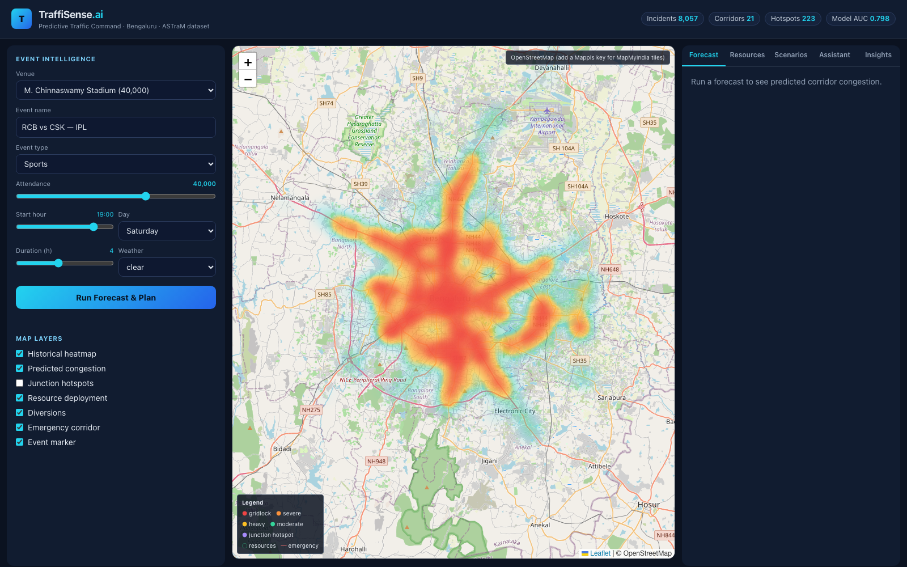
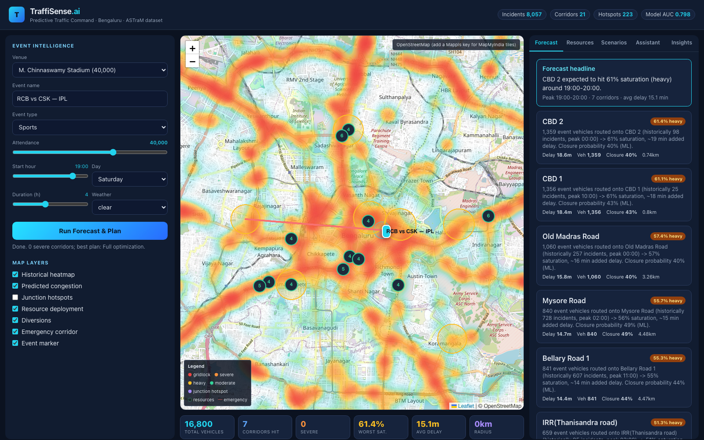
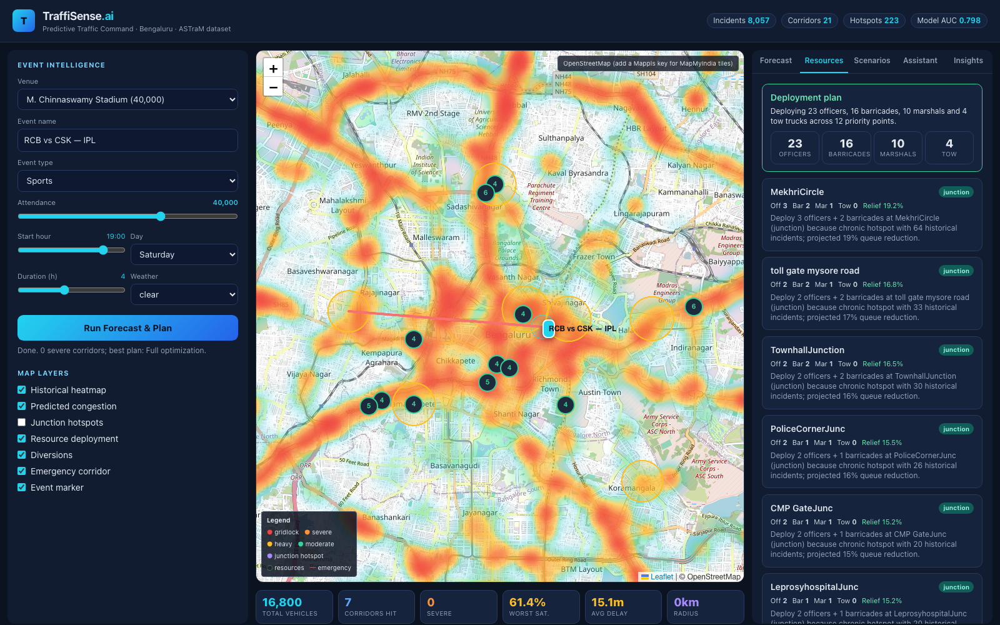
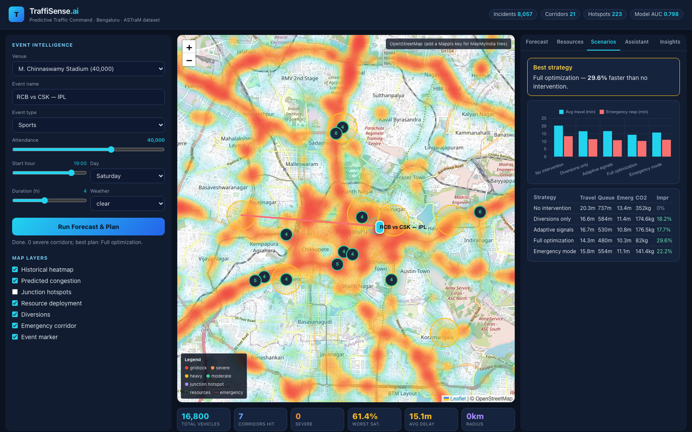
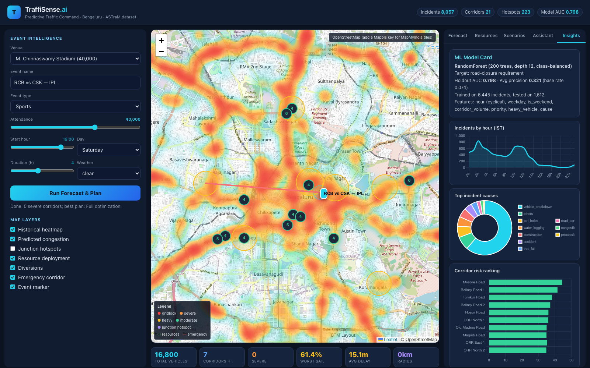
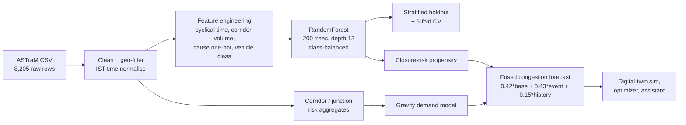

# TraffiSense.ai

**Predictive, simulation-driven traffic command for large city events.**
Built on the real **ASTraM Bengaluru Traffic Police** incident dataset, with
**MapMyIndia / Mappls** mapping infrastructure.

TraffiSense turns traffic management from reactive to proactive: forecast an
event's congestion impact *before* it happens, simulate intervention
strategies, and get explainable recommendations for officers, barricades,
diversions and emergency corridors.

---

## Demo walkthrough (live screenshots)

**1. Command dashboard** — historical incident heatmap from 8,057 real ASTraM
records, with the event builder on the left and live data badges up top.



**2. AI traffic-impact forecast** — one click drops the event, predicts
corridor congestion (rings), scatters optimized resource markers, and explains
every corridor card (vehicles, delay, ML closure risk).



**3. Resource deployment optimization** — officers, barricades, marshals and
tow trucks allocated by marginal need, each with a plain-English rationale and
expected queue relief.



**4. Scenario comparison** — five strategies (no intervention, diversions,
adaptive signals, full optimization, emergency mode) ranked on travel time,
queue, emergency response and CO2.



**5. AI command assistant** — ask natural-language what-ifs; every answer is
computed live from the simulation (no external LLM).


**6. Insights + honest ML model card** — incidents-by-hour, top causes, and the
RandomForest closure-risk model's real holdout metrics.



---

## What it does (the 5 deep features)

1. **Event Intelligence** — pick a real Bengaluru venue (Chinnaswamy Stadium,
   Palace Grounds, BIEC...) and define attendance, time, day and weather.
2. **AI Traffic Impact Prediction** — a gravity demand model spreads attendee
   vehicles across surrounding corridors, fused with real historical incident
   density and an ML closure-risk model. Every number is explained.
3. **Live Command Map** — historical incident heatmap, predicted congestion
   rings, junction hotspots, resource markers, diversion lines and the reserved
   emergency corridor, all on a MapMyIndia base (OSM fallback).
4. **Resource Deployment Optimization** — marginal-need allocation of officers,
   barricades, marshals and tow trucks, each with a plain-English rationale.
5. **Scenario Comparison + AI Command Assistant** — compare 5 strategies side
   by side (travel time, queue, throughput, fuel, emissions, emergency
   response), and ask natural-language "what-if" questions.

Plus: digital-twin simulation, diversion planning, emergency corridors and a
post-hoc insights tab with an honest ML model card.

---

## Machine Learning (the core of TraffiSense)

This is a machine-learning system end to end: a trained model, an
evidence-grounded forecast engine, and an honest evaluation. No magic numbers.

### 1. ML pipeline



### 2. The target (and the leakage trap we avoided)

We predict **"will this incident require a road closure?"** — a genuinely
useful, **imbalanced** operational signal (**596 closures / 8,057 = 7.4%** base
rate).

Two naive targets were rejected *because they leak*:

| Rejected target | Why it's a trap |
|---|---|
| `priority` (High/Low) | It's a **deterministic corridor label**, not incident severity. A model "scores" AUC 0.998 by memorising the corridor. Worthless. |
| `closure_flag` as a feature | Literally the target in disguise. |

Catching and removing leakage is the difference between a real model and a
demo that lies. Our reported numbers are what the model *actually* generalises.

### 3. Feature engineering (15 features)

- **Cyclical time** — `hour_sin`, `hour_cos` so 23:00 and 00:00 are neighbours.
- **`weekday`, `is_weekend`** — weekly demand rhythm.
- **`corridor_volume`** — log-normalised incident volume per corridor
  (volume only, deliberately **not** the risk score, to avoid leaking the
  high-priority rate).
- **`priority_high`, `heavy_vehicle`** — operational context.
- **8 one-hot `cause` features** — breakdown, accident, water-logging,
  tree-fall, pot-holes, construction, road-conditions, congestion.

### 4. Results (real, reproducible: `python scripts/ml_metrics.py`)

| Metric | Score |
|---|---|
| Holdout ROC-AUC | **0.798** |
| Holdout Average Precision | **0.321** (vs 0.074 base rate -> **4.3x lift**) |
| 5-fold CV ROC-AUC | **0.756 +/- 0.022** |
| 5-fold CV Avg Precision | **0.267 +/- 0.031** |
| Accuracy @ best-F1 | **0.92** |
| Closure precision / recall / F1 | 0.47 / 0.38 / **0.42** |

**Confusion matrix** (holdout = 1,612 incidents, threshold tuned for best F1):

|              | pred: no closure | pred: closure |
|--------------|:---:|:---:|
| **true: no closure** | 1442 (TN) | 51 (FP) |
| **true: closure**    | 74 (FN)   | 45 (TP) |

**Top feature importances:**

| Feature | Importance |
|---|---|
| corridor_volume | 0.172 |
| hour_sin | 0.129 |
| hour_cos | 0.126 |
| cause = vehicle_breakdown | 0.113 |
| cause = tree_fall | 0.112 |
| weekday | 0.105 |

Intuitive and defensible: *where* (corridor load) and *when* (time of day,
day of week) dominate, and **tree-fall / construction causes** carry the
highest closure risk per incident — exactly what a traffic controller would
tell you.

### 5. From model to decisions

The trained closure-risk model feeds a transparent fusion that produces the
per-corridor congestion forecast:

```
congestion = (0.42 * time_of_day_baseline
            + 0.43 * event_demand_load          # gravity model, distance-decayed
            + 0.15 * historical_incident_risk)   # real ASTraM density
            * weather_multiplier
```

Every downstream output — the simulator's KPIs, the optimizer's deployments,
the assistant's answers — traces back to this evidence chain. **Explainable by
construction.**

### Dataset at a glance

**8,057** cleaned incidents (Nov 2023 - Apr 2024), 21 corridors, 223 chronic
junction hotspots, timestamps normalised to IST (UTC+5:30).

---

## Run it

```bash
./run.sh            # creates venv, installs deps, serves, opens browser
# or manually:
uv venv --python 3.11 && source .venv/bin/activate
uv pip install -r requirements.txt
uvicorn app.main:app --port 8077
```

Open http://127.0.0.1:8077

### Enable MapMyIndia / Mappls tiles

```bash
cp .env.example .env
# paste your keys:
#   MAPPLS_MAP_SDK_KEY=...   (browser map tiles)
#   MAPPLS_REST_KEY=...      (server-side REST, optional)
```

Without a key the map falls back to OpenStreetMap so the demo always works.

---

## Architecture

```
app/
  config.py      tunables + Mappls keys (env)
  data.py        ASTraM loader + corridor/junction/temporal intelligence
  ml.py          RandomForest closure-risk model (trained + cached)
  predictor.py   gravity demand x history x ML -> congestion forecast
  simulator.py   digital-twin lite + scenario comparison
  optimizer.py   resource deployment (marginal need + rationale)
  routing.py     diversion plans + emergency corridor
  assistant.py   self-contained NL command brain
  main.py        FastAPI transport layer
web/             command-center dashboard (Leaflet + Mappls, Chart.js, Tailwind)
```

Every engine is a small, single-responsibility module — DRY, testable, and all
under the 600-line budget.

---

## Tech

FastAPI · scikit-learn · pandas · Leaflet + MapMyIndia (Mappls) raster tiles ·
Chart.js · Tailwind. No external LLM required — the assistant computes every
answer from live engine output, so it is always accurate and demo-safe.
